---
## Front matter
lang: ru-RU
title: Лабораторная работа №7
subtitle: Операционные системы
author:
  - Кудякова С. А.
institute:
  - Российский университет дружбы народов, Москва, Россия

date: 22 марта 2024
т
## i18n babel
babel-lang: russian
babel-otherlangs: englishт

## Formatting pdfт
toc: false
toc-title: Содержание
slide_level: 2
aspectratio: 169
section-titles: true
theme: metropolis
header-includes:
 - \metroset{progressbar=frametitle,sectionpage=progressbar,numbering=fraction}
 - '\makeatletter'
 - '\beamer@ignorenonframefalse'
 - '\makeatother'
---

## Цель

  Цель данной работы - ознакомление с файловой системой Linux, её структурой, именами и содержанием каталогов. Приобретение практических навыков по применению команд для работы с файлами и каталогами, по управлению процессами (и работами), по проверке использования диска и обслуживанию файловой системы.

# Задания

1. Выполнить все примеры из лабораторной работы
2. Выполнить команды по копированию, созданию и перемещению файлов и каталогов
3. Определить опции команды chmod
4. Изменить права доступа к файлам
5. Прочитать документацию о командах mount, fsck, mkfs, kill

## Выполнение лабораторной работы

 Создаю файл, дважды копирую его с новыми имнами и проверяю, что все команды были выполнены корректно. (рис. 1).

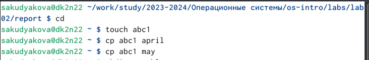{#fig:1 width=70%}

## Выполнение лабораторной работы

 Создаю директорию, копирую в нее два файла, созданных на прошлом этапе, проверяю, что все скопировалось. (рис. 2).
 
{#fig:2 width=70%}

## Выполнение лабораторной работы

 Копирую файл, находящийся не в текущей диреткории в файл с новым именем тоже не текущей директории . (рис. 3).

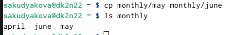{#fig:3 width=70%}
т
## Выполнение лабораторной работы

Создаю новую директорию. Копирую предыдущую созданную директорию вместе со всем содержимым в каталог /tmp. Затем копирую предыдущую созданную директорию в новую созданную. (рис. 4).

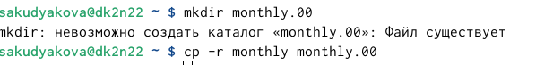{#fig:4 width=70%}

## Выполнение лабораторной работы

 Переименовываю файл, затем перемещаю его в каталог. (рис. 5). 

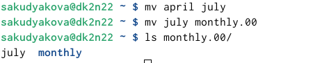{#fig:5 width=70%}

## Выполнение лабораторной работы

 Создаю новую диреткорию, переименовываю monthly.00 в monthly.01, перемещаю директорию в директорию reports, переименовываю эту директорию, убираю из названия 01(рис.6).
  
{#fig:6 width=70%}

## Выполнение лабораторной работы

 Создаю пустой файл, проверяю права доступа у него, изменяю права доступа, добавляя пользователю (создателю) можно выполнять файл . (рис.7)
  
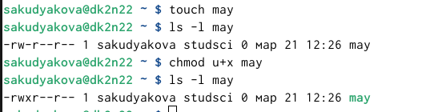{#fig:7 width=70%}

## Выполнение лабораторной работы
 
 Создаю пустой файл, проверяю права доступа у него, изменяю права доступа, добавляя пользователю (создателю) можно выполнять файл (рис. 8)
 
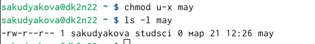{#fig:8 width=70%}

## Выполнение лабораторной работы

 Меняю права доступа у директории: группы и остальные пользователи не смогут ее прочетсь. (рис. 9).
 
{#fig:9 width=70%}

## Выполнение лабораторной работы

 Изменяю права доступа у директории, запрещаю группам и остальным пользователям читать. Создаю новый пустой файл, даю ему права доступа: группы могут в этом чато писатю содержимое. (рис. 10)

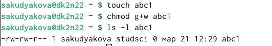{#fig:10 width=70%}

## Выполнение лабораторной работы

 Проверяю файловую систему. Далее копирую файл в домашний каталог с новым именем, создаю новую пустую
директорию, перемещаю файл в эту директорию, переименовываю файл (рис. 11)
 
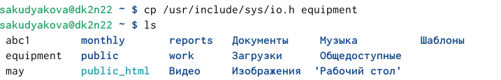{#fig:11 width=70%}

## Выполнение лабораторной работы

Проверяю файловую систему. Далее копирую файл в домашний каталог с новым именем, создаю новую пустую
директорию, перемещаю файл в эту директорию, переименовываю файл (рис. 12)

{#fig:12 width=70%}

## Выполнение лабораторной работы

 Проверяю файловую систему. Далее копирую файл в домашний каталог с новым именем, создаю новую пустую
директорию, перемещаю файл в эту директорию, переименовываю файл (рис.13)

{#fig:13 width=70%}

## Выполнение лабораторной работы

 Проверяю файловую систему. Далее копирую файл в домашний каталог с новым именем, создаю новую пустую
директорию, перемещаю файл в эту директорию, переименовываю файл (рис. 14)

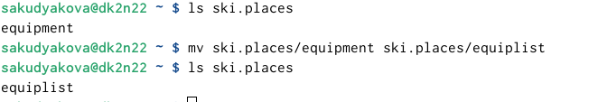{#fig:14 width=70%}

## Выполнение лабораторной работы
 Создаю новый файл, копирую его в новую директорию, но уже сратзу с новым именем. Создаю внутри этого каталога подкаталог, перемещаю файлы в подкаталог (рис.15)

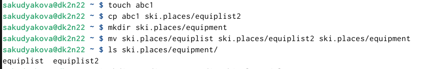{#fig:15 width=70%}

# Выполнение лабораторной работы

Создаю новую директорию, в этой же строчке перемещаю ее с новым именем в директорию, созданную в прошлый раз (рис. 16)

{#fig:16 width=70%}

## Выполнение лабораторной работы

 Проверяю, какие права нужно поменять и как, чтобу у новой директория были нужные по заданию права. (рис.17)

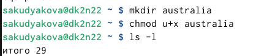{#fig:17 width=70%}

## Выполнение лабораторной работы

 Проверяю, какие права нужно поменять и как, чтобу у новых файлов были нужные по заданию права. (рис.18)
 
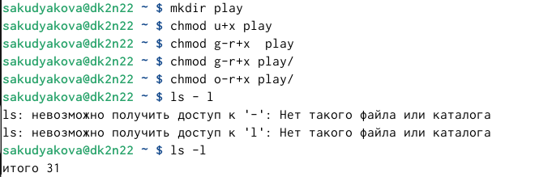{#fig:18 width=70%}
 
## Выполнение лабораторной работы

  Создаю файл, добавляю в правах доступа право но исполнение и убираю право на запись для владельца, затем создаю следующий файл, ему в правах доступа добавляю право на запись для группы. (рис.19)
  
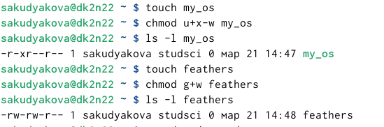{#fig:19 width=70%}
 
## Выполнение лабораторной работы

 Читаю содержимое файла (рис.20)
 
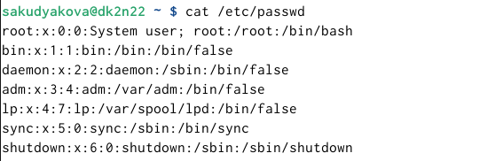{#fig:20 width=70%}

## Выполнение лабораторной работы

 Копирую файл с новым именем, перемещаю его в ранее созданную директорию, рекрсивно копирую ее с новым именем, рекурсивно копирую в нее скопированную до этого папку (рис.21)

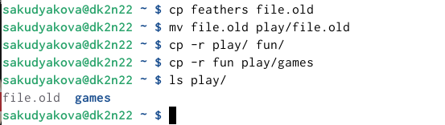{#fig:21 width=70%}

## Выполнение лабораторной работы

 Убираю право на чтение у файла для создателя, поэтому не могу его прочесть, также не получается его скопировать, так как отказано в доступе, возвращаю все права (рис.22)
 
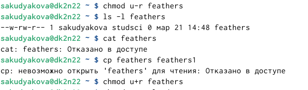{#fig:22 width=70%}

## Выполнение лабораторной работы

 Убираю у директории право на испольнение для пользователя, пытаюсь в нее войти, но в доступе отказано, возвращаю права. (рис.23)
 
 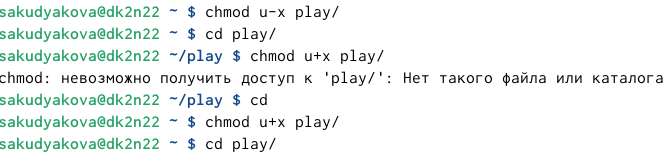{#fig:23 width=70%}

## Выполнение лабораторной работы 

  Я прочитала описание каждой из четырех команд с помощью man (рис. 24)- mount — утилита командной строки в UNIX-подобных операционных системах. Применяется для монтирования файловых систем. - fsck (проверка файловой системы) - это утилита командной строки, которая позволяет выполнять проверки согласованности и интерактивное исправление в одной или нескольких файловых системах Linux. Он использует программы, специфичные для типа файловой системы, которую он проверяет. - mkfs используется для создания файловой системы Linux на некотором устройстве, обычно в разделе жёсткого диска. В качестве аргумента filesys для файловой системы может выступать или название устройства - Команда Kill посылает указанный сигнал указанному процессу. Если не указано ни одного сигнала, посылается сигнал SIGTERM. Сигнал SIGTERM завершает лишь те процессы, которые не обрабатывают его приход. Для других процессов может быть необходимым послать сигнал SIGKILL, поскольку этот сигнал перехватить невозможно.

{#fig:24 width=70%}

# Выводы

 В ходе данной лабораторной работы я ознакомилась с файловой системой Linux, её структурой, именами и содержанием каталогов. Приобрела практические навыки по применению команд для работы с файлами и каталогами, по управлению процессами (и работами), по проверке использования диска и обслуживанию файловой системы
 
